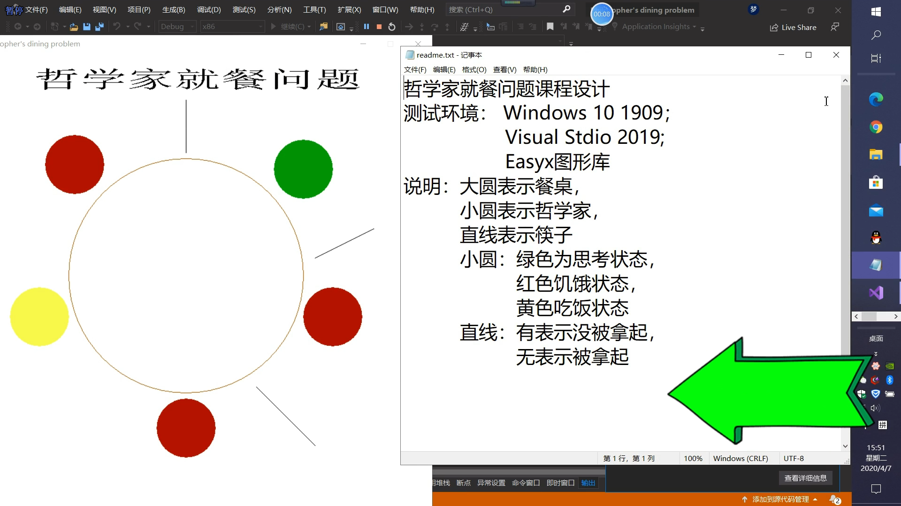

# 哲学家就餐问题课程设计
## 示例说明

编程语言：`C++`
录屏软件：`EV录屏`
测试环境： `Windows 10 1909`；
	  `Visual Stdio 2019`; 
	  `Easyx图形库`
说明：

- 大圆表示餐桌，

- 小圆表示哲学家，

  

- 直线表示筷子

- 小圆：绿色为思考状态，

- 红色饥饿状态，

- 黄色吃饭状态

- 直线：有表示没被拿起，无表示被拿起

## 问题解析 

哲学家就餐问题（Dining Philosophers Problem）是一个经典的并发算法问题，由荷兰计算机科学家艾兹格·迪科斯彻（Edsger W. Dijkstra）在1965年提出。这个问题用来描述在并发计算中资源分配和死锁问题。
问题描述如下：
假设有五位哲学家围坐在一张圆桌旁，每位哲学家面前有一盘食物和一根筷子。由于哲学家们要么在思考，要么在吃饭，所以他们需要两根筷子才能就餐。桌上的筷子是有限的，正好与哲学家数量相同。
问题在于如何设计一个算法，使得每位哲学家都能够交替地进行思考和吃饭，而不会出现以下情况：

1. **死锁**：所有哲学家都同时拿起他们左边的筷子，然后等待右边的筷子，导致每个人都无法继续吃饭，系统陷入停滞。
2. **饥饿**：某个哲学家永远拿不到筷子，因此永远无法吃饭。
## 解决哲学家就餐问题有多种策略：
3. **资源分级**：将筷子编号，规定哲学家必须先拿起编号较小的筷子，然后再尝试拿起编号较大的筷子。这样可以避免所有哲学家同时等待同一根筷子的情况。
4. **最多允许四个哲学家同时拿筷子**：通过限制同时拿筷子的哲学家数量，确保至少有一位哲学家可以吃饭，从而避免死锁。
5. **服务员模式**：引入一个服务员角色，只有当服务员允许时，哲学家才能拿起筷子。服务员可以确保不会出现所有哲学家同时拿起筷子的情况。
6. **尝试等待策略**：哲学家尝试拿筷子，如果拿不到，就放下已经拿起的筷子，等待一段时间后重试。
    这个问题在计算机科学中非常有名，因为它揭示了并发编程中资源共享和同步的复杂性。解决哲学家就餐问题的策略被广泛应用于操作系统的进程调度、资源分配和同步机制设计中，以避免死锁和资源饥饿问题。
